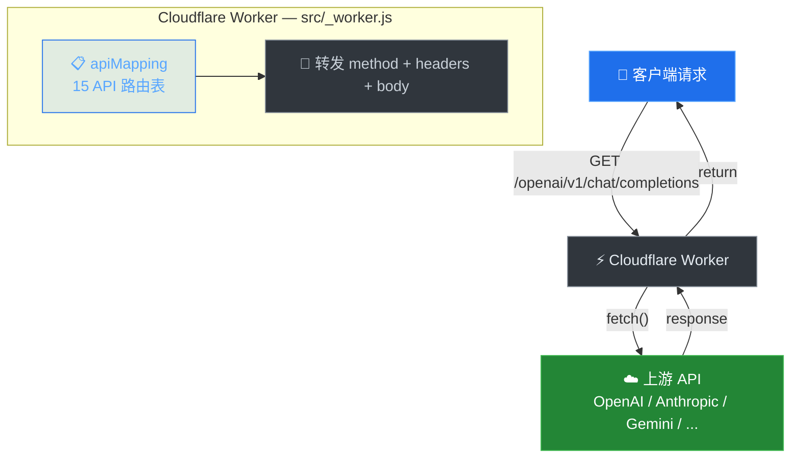

# 🌐 Serverless API Proxy

<p align="center">


</p>

> **多 API 代理网关**，基于 Cloudflare Workers —— 一个域名代理多个 AI 平台。

---

## ✨ 特性

- **零配置** — 部署即可使用
- **多 API 支持** — OpenAI、Gemini、Claude、Groq 等
- **完整透传** — 认证请求头原样转发
- **统一域名** — 所有 API 共享同一端点

---

## 🚀 快速开始

### 一键部署到 Cloudflare Workers

<p align="center">
<a href="https://deploy.workers.cloudflare.com/?url=https://github.com/lopins/serverless-api-proxy">

</a>
</p>

```bash
# 克隆项目
git clone https://github.com/lopins/serverless-api-proxy.git
cd serverless-api-proxy

# 使用 Wrangler 部署
gh workflow run deploy.yml
```

---

## 📋 支持的 API

| 🔗 路径前缀 | 🎯 目标 API | 📝 示例路由 |
|:-----------|:------------|:-----------|
| `/openai` | [OpenAI](https://api.openai.com) | `/openai/v1/chat/completions` |
| `/claude` | [Anthropic](https://api.anthropic.com) | `/claude/v1/completions` |
| `/gemini` | [Google Gemini](https://generativelanguage.googleapis.com) | `/gemini/v1/models/gemini-pro:generateContent` |
| `/groq` | [Groq](https://api.groq.com) | `/groq/openai/v1/chat/completions` |
| `/cohere` | [Cohere](https://api.cohere.ai) | `/cohere/v1/chat/completions` |
| `/huggingface` | [Hugging Face](https://api-inference.huggingface.co) | `/huggingface/models/meta-llama/Llama-3.1-70B-Instruct/v1/chat/completions` |
| `/fireworks` | [Fireworks AI](https://api.fireworks.ai) | `/fireworks/v1/chat/completions` |
| `/openrouter` | [OpenRouter](https://openrouter.ai/api) | `/openrouter/api/v1/chat/completions` |
| `/discord` | [Discord](https://discord.com/api) | `/discord/api/v10/users/@me` |
| `/telegram` | [Telegram Bot API](https://api.telegram.org) | `/telegram/bot<TOKEN>/getMe` |
| `/meta` | [Meta AI](https://www.meta.ai/api) | `/meta/api/chat` |
| `/x` | [xAI](https://api.x.ai) | `/x/v1/chat/completions` |
| `/together` | [Together AI](https://api.together.xyz) | `/together/v1/chat/completions` |
| `/novita` | [Novita AI](https://api.novita.ai) | `/novita/v3/chat/completions` |
| `/portkey` | [Portkey AI](https://api.portkey.ai) | `/portkey/v1/chat/completions` |

---

## 💻 使用示例

### Python (OpenAI SDK 兼容)

```python
import random
import re
from openai import OpenAI

ApiKey = "sk-your-api-key-here"
BaseUrl = "https://your-domain/openai/v1"
models = ["gpt-3.5-turbo", "gpt-4o-mini"]

def gentext():
    client = OpenAI(api_key=ApiKey, base_url=BaseUrl)
    model = random.choice(models)
    try:
        completion = client.chat.completions.create(
            model=model,
            messages=[
                {"role": "system", "content": "你是一个聪明且富有创造力的小说作家。"},
                {"role": "user", "content": "请写一篇关于善良的短篇童话故事。"}
            ],
            top_p=0.7,
            temperature=0.7
        )
        text = completion.choices[0].message.content
        print(f"{model}: {re.sub(r'\n+', '', text)}")
    except Exception as e:
        print(f"{model}: {str(e)}\n")
```

### cURL

```bash
curl https://your-domain/openai/v1/chat/completions \
  -H "Authorization: Bearer sk-your-api-key" \
  -H "Content-Type: application/json" \
  -d '{"model": "gpt-3.5-turbo", "messages": [{"role": "user", "content": "你好！"}]}'
```

---

## 🏗️ 架构原理



---

## ⚠️ 注意事项

- 🔑 **API 密钥**：通过请求头传递您的 API Key（`Authorization: Bearer ...`）
- 🌍 **无 CORS 头**：此代理面向服务端调用；浏览器直接调用可能受跨域限制
- 📦 **无速率限制**：上游平台的限流策略直接生效，本代理不做额外控制

---


---

## 💻 本地运行

使用 Node.js 22+，无需额外依赖：

```bash
# 启动本地服务（默认端口 8787）
npm run dev

# 自定义端口
PORT=3000 npm run dev
```

访问 `http://localhost:8787/openai/v1/chat/completions` 即可测试。

---
<div align="center">

**由 [lopinx](https://github.com/lopinx) 用 ❤️ 制作**

</div>
